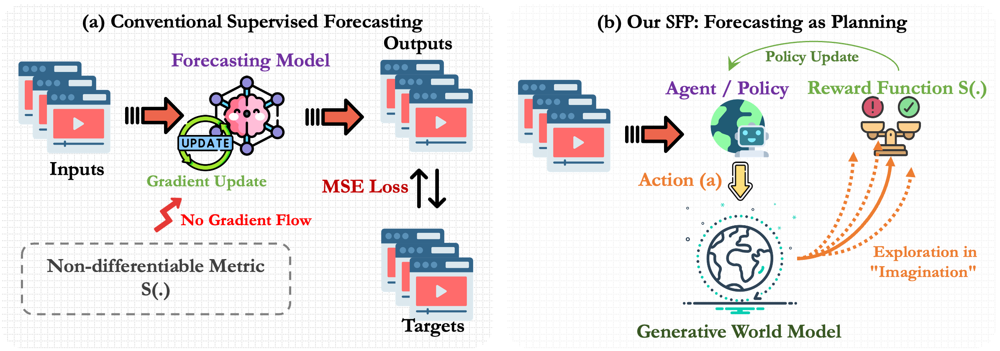
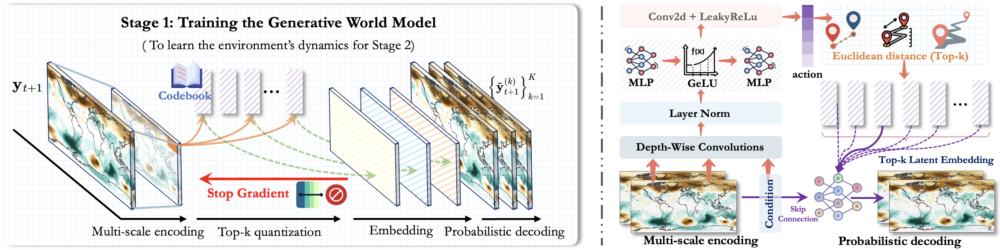
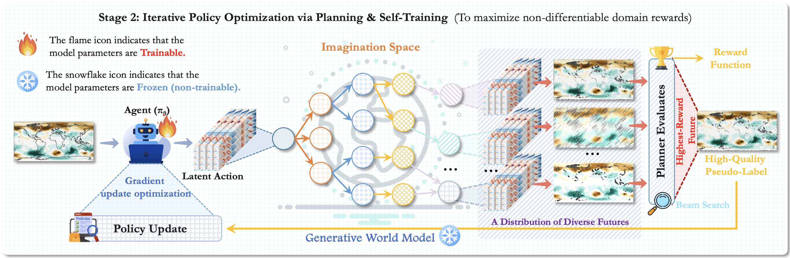

🚀 **Note to Reviewers:** This anonymous GitHub repository accompanies our paper submission. We chose this format to effectively showcase dynamic visualizations (e.g., animated GIFs) of our forecasting results, which are best understood in motion. The repository is fully anonymized and contains no information that could identify the authors. We thank you for your time and careful consideration in reviewing our work.

This repository contains the official PyTorch implementation for our paper, "**Spatiotemporal Forecasting as Planning: A Model-Based Reinforcement Learning Approach with Generative World Models**", submitted for review.

# Spatiotemporal Forecasting as Planning (SFP)

We introduce **SFP (Spatiotemporal Forecasting as Planning)**, a novel paradigm that reframes spatiotemporal forecasting as a Model-Based Reinforcement Learning (MBRL) planning problem. SFP is designed to address the critical challenges faced by conventional deep learning methods: optimizing for **non-differentiable**, domain-specific metrics (e.g., CSI in extreme weather prediction) and performing robustly in data-scarce scenarios.

---

## 🚀 Core Idea: From Supervised Learning to Planning

### The Dilemma of Conventional Methods

Conventional forecasting models (Fig. a) rely on differentiable proxy losses like Mean Squared Error (MSE) for end-to-end optimization. However, in many scientific domains, true performance is measured by domain-specific metrics that are often **non-differentiable** (e.g., Critical Success Index (CSI), Turbulent Kinetic Energy (TKE) spectrum). This creates a **"Fundamental Disconnect"** between the training objective and the actual evaluation criteria, leading to models that, despite low MSE, fail to capture critical extreme events or maintain physical consistency.

### Our New Paradigm: SFP

The SFP framework (Fig. b) breaks this limitation. We treat the forecasting model as an **Agent** that learns a policy. Instead of directly outputting a final prediction, the agent generates an "intention" or **Action**. This action guides a learned **Generative World Model**, which performs forward exploration in its "imagination space" to generate a diverse set of high-fidelity future possibilities. A **Planning Algorithm** then leverages the non-differentiable domain metric as a **Reward Function** to identify the future trajectory with the highest return. Finally, this high-reward trajectory serves as a high-quality **pseudo-label** to update the agent's policy via an iterative **self-training** loop.

  

  <b>Figure 1</b>: (a) The conventional supervised learning paradigm vs. (b) our SFP planning paradigm. SFP forms a closed-loop learning system that allows the agent to optimize directly for the true objectives of the task.

---

## ✨ Key Contributions & Highlights

1.  **A New Paradigm**: We are the first to systematically formalize spatiotemporal forecasting as an MBRL problem, providing a principled pathway to directly optimize for non-differentiable scientific metrics.

2.  **An Innovative Framework**: We design and implement SFP, which creatively integrates:
    *   A VQ-VAE-based **Generative World Model** to simulate the stochastic dynamics of physical systems.
    *   A **Beam Search-based Planning Algorithm** for efficient exploration within the "imagined" future.
    *   A **closed-loop self-training process** that distills knowledge from non-differentiable rewards into the agent's policy.

  

  <b>Figure 2: Architecture of our Generative World Model.

  

  <b>Figure 3: Iterative Policy Optimization via Planning and Self-Training.

3.  **State-of-the-Art Performance**: On several challenging benchmarks (e.g., extreme weather, turbulence, combustion), SFP demonstrates significant improvements:
    *   **Significant Error Reduction**: Achieved **up to 39% MSE reduction** across various tasks.
    *   **Optimized Domain Metrics**: Boosted the Critical Success Index (CSI) by an average of **29.7%** on the SEVIR dataset and reduced the Turbulent Kinetic Energy (TKE) spectrum error by an average of **57.3%** on the NSE task.
    *   **Enhanced Physical Consistency**: Generated more realistic, fine-grained vortex structures in turbulence simulations with energy spectra that closely match ground truth.
    *   **Superior Extreme Event Capture**: Accurately predicted high-intensity cores of marine heatwaves that were completely missed by baseline models, especially in data-scarce settings.
  

