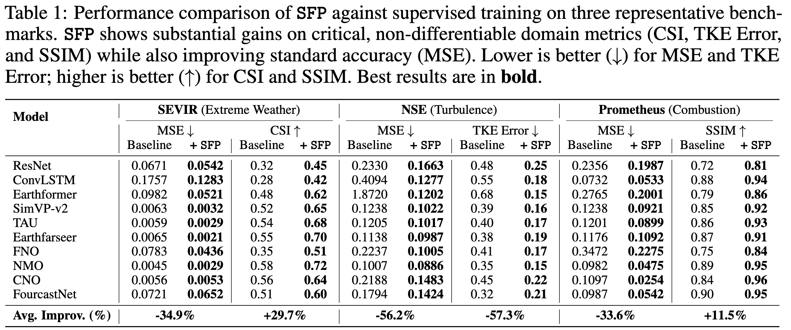
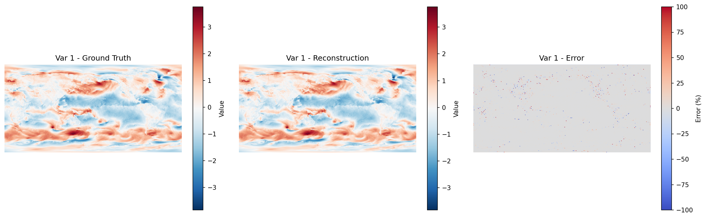

🚀 **Note to Reviewers:** This anonymous GitHub repository accompanies our paper submission. We chose this format to effectively showcase dynamic visualizations (e.g., animated GIFs) of our forecasting results, which are best understood in motion. The repository is fully anonymized and contains no information that could identify the authors. We thank you for your time and careful consideration in reviewing our work.

---

This repository contains the official PyTorch implementation for our paper, "**Spatiotemporal Forecasting as Planning: A Model-Based Reinforcement Learning Approach with Generative World Models**", submitted for review.

# Spatiotemporal Forecasting as Planning (SFP)

We introduce **SFP (Spatiotemporal Forecasting as Planning)**, a novel paradigm that reframes spatiotemporal forecasting as a Model-Based Reinforcement Learning (MBRL) planning problem. SFP is designed to address the critical challenges faced by conventional deep learning methods: optimizing for **non-differentiable**, domain-specific metrics (e.g., CSI in extreme weather prediction) and performing robustly in data-scarce scenarios.

---

## 🚀 Core Idea: From Supervised Learning to Planning

### The Dilemma of Conventional Methods

Conventional forecasting models (Fig. 1a) rely on differentiable proxy losses like Mean Squared Error (MSE) for end-to-end optimization. However, in many scientific domains, true performance is measured by domain-specific metrics that are often **non-differentiable** (e.g., Critical Success Index (CSI), Turbulent Kinetic Energy (TKE) spectrum). This creates a **"Fundamental Disconnect"** between the training objective and the actual evaluation criteria, leading to models that, despite low MSE, fail to capture critical extreme events or maintain physical consistency.

### Our New Paradigm: SFP

The SFP framework (Fig. 1b) breaks this limitation. We treat the forecasting model as an **Agent** that learns a policy. Instead of directly outputting a final prediction, the agent generates an "intention" or **Action**. This action guides a learned **Generative World Model**, which performs forward exploration in its "imagination space" to generate a diverse set of high-fidelity future possibilities. A **Planning Algorithm** then leverages the non-differentiable domain metric as a **Reward Function** to identify the future trajectory with the highest return. Finally, this high-reward trajectory serves as a high-quality **pseudo-label** to update the agent's policy via an iterative **self-training** loop.

<p align="center">
  
</p>
<p align="center">
  <b>Figure 1</b>: (a) The conventional supervised learning paradigm vs. (b) our SFP planning paradigm. SFP forms a closed-loop learning system that allows the agent to optimize directly for the true objectives of the task.
</p>

---

## ✨ Framework & Highlights

1.  **A New Paradigm**: We are the first to systematically formalize spatiotemporal forecasting as an MBRL problem, providing a principled pathway to directly optimize for non-differentiable scientific metrics.

2.  **An Innovative Framework**: We design and implement SFP, which creatively integrates:
    *   A VQ-VAE-based **Generative World Model (GWM)** to simulate the stochastic dynamics of physical systems (Fig. 2).
    *   A **Beam Search-based Planning Algorithm** for efficient exploration within the "imagined" future.
    *   A **closed-loop self-training process** that distills knowledge from non-differentiable rewards into the agent's policy (Fig. 3).

<p align="center">
  
</p>
<p align="center">
  <b>Figure 2</b>: Architecture of our Generative World Model (GWM).
</p>
    
<p align="center">
  
</p>
<p align="center">
  <b>Figure 3</b>: Iterative Policy Optimization via Planning and Self-Training.
</p>

3.  **State-of-the-Art Performance**: On several challenging benchmarks (e.g., extreme weather, turbulence, combustion), SFP demonstrates significant improvements:
    *   Achieved **up to 39% MSE reduction** across various tasks.
    *   Boosted the CSI by an average of **29.7%** on the SEVIR dataset and reduced the TKE spectrum error by an average of **57.3%** on the NSE task.
    *   Accurately predicted high-intensity cores of marine heatwaves that were completely missed by baseline models.

<p align="center">
  
</p>
  
---

## 🛠️ Getting Started

Follow these steps to set up the environment, prepare the data, and run the complete SFP two-stage training pipeline.

### 1. Environment Setup

We recommend using Conda to set up the environment:

```bash
# Clone the repository
git clone https://github.com/easylearningscores/SFP.git
cd SFP

# Create and activate the Conda environment
conda create -n sfp python=3.8
conda activate sfp

# Install dependencies
pip install -r requirements.txt
```

### 2. Dataset Preparation
Please download the required datasets and place them under a unified data/ directory. You will need to specify the path to your data in the configuration files.


### 3. SFP Two-Stage Training Pipeline
Our framework is trained in two separate stages. Each stage is executed by a main script, with parameters managed through YAML configuration files located in the configs/ directory.


#### **Stage 1: Pre-training the Generative World Model (GWM)**

In this stage, we train the conditional VQ-VAE model, defined in `models/gwm.py`. The objective is to learn the fundamental dynamics of the physical system through a reconstruction task. A well-trained GWM provides a high-fidelity "imagination space," which is a critical prerequisite for the planning and self-training in Stage 2.

**1. Configure:**
Open the `configs/gwm_config.yaml` file. Adjust the data paths, batch size, learning rate, and other model parameters to match your specific dataset and hardware setup.

**2. Run Training:**
Execute the Stage 1 training script from the project's root directory. The script is designed for multi-GPU training using DDP.

```bash
# Replace N with the number of GPUs you wish to use (e.g., 4 or 8)
torchrun --nproc_per_node=N train_stage1_gwm.py --config configs/gwm_config.yaml
```
**3. Outcome:**
This script will train the GWM and save the best-performing checkpoint (e.g., gwm_best.pth) to the output path specified in your configuration file.
Example reconstruction results from the trained GWM are shown below:
<p align="center">

</p>
<p align="center">
<b>Figure 4</b>: Reconstruction results of the GWM.
</p>

#### **Stage 2: Optimizing the Agent via Planning & Self-Training**

With the weights of the Generative World Model frozen, we now proceed to train the Agent (`models/agent.py`). The Agent's policy is optimized through our proposed planning and self-training loop. This process enables the Agent to learn how to achieve high scores on the non-differentiable domain metric defined by the reward function.

**1. Configure:**
Open the `configs/agent_config.yaml` file. **Crucially, ensure the `gwm_checkpoint_path` points to the model saved in Stage 1.** You can also configure the `backbone_name` (e.g., `simvp`, `fno`), the `reward_function` (`csi`, `tke`, `ssim`), and other training hyperparameters.

**2. Run Training:**
Execute the Stage 2 training script. It also supports multi-GPU training with DDP.

```bash
# Replace N with the number of GPUs you wish to use
torchrun --nproc_per_node=N train_stage2_agent.py --config configs/agent_config.yaml
```
**3. What Happens Inside the Loop:**
*   The **Agent** proposes an `action` based on the current state.
*   The **Planner** uses the frozen GWM to generate a diverse set of possible futures based on the action.
*   The non-differentiable **reward function** evaluates each future to find the one with the highest reward.
*   This high-reward future is selected as the **pseudo-label**.
*   The **Agent** is then updated by training it to predict this high-quality pseudo-label.

**4. Outcome:**
This script will save the final trained Agent model to the path specified in your config file. This Agent is now specialized in optimizing for the target domain metric.
```bash
torchrun --nproc_per_node=N train_stage2_agent.py --config configs/agent_config.yaml
```

